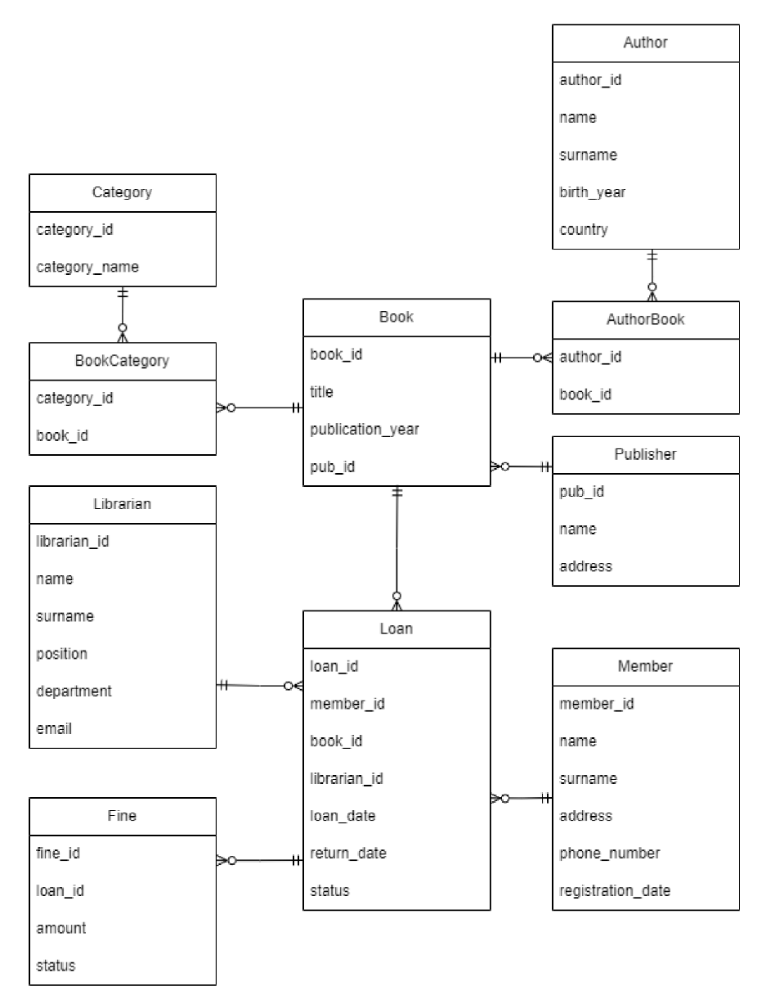

# Документація схеми бази даних

## Діаграма сутність-зв'язок (ERD)

## Опис таблиць

### Таблиця: `Book`

**Призначення:** Зберігає основну інформацію про фонди бібліотеки (книги).

| Стовпець           | Тип         | Обмеження           | Опис                             |
| ------------------ | ----------- | ------------------- | -------------------------------- |
| `book_id`          | INT         | PRIMARY KEY, SERIAL | Унікальний ідентифікатор книги   |
| `title`            | VARCHAR(64) | NOT NULL            | Назва книги                      |
| `publication_year` | SMALLINT    | NULL                | Рік видання книги                |
| `pub_id`           | INT         | FOREIGN KEY         | Посилання на видавця             |
| `created_at`       | TIMESTAMP   | DEFAULT NOW()       | Дата додавання книги до каталогу |

**Індекси:**

- `Book_title_idx` на `title` (для пришвидшення пошуку книг за назвою).

**Зв'язки:**

- Багато-до-одного з `Publisher` (книга має одного видавця).
- Багато-до-багатьох з `Author` (через таблицю `AuthorBook`).
- Багато-до-багатьох з `Category` (через таблицю `BookCategory`).
- Один-до-багатьох з `Loan` (книгу можуть видавати багато разів).

---

### Таблиця: `Member`

**Призначення:** Зберігає персональні дані читачів бібліотеки.

| Стовпець            | Тип         | Обмеження           | Опис                                            |
| ------------------- | ----------- | ------------------- | ----------------------------------------------- |
| `member_id`         | INT         | PRIMARY KEY, SERIAL | Унікальний номер читацького квитка              |
| `name`              | VARCHAR(32) | NOT NULL            | Ім'я читача                                     |
| `surname`           | VARCHAR(32) | NOT NULL            | Прізвище читача                                 |
| `address`           | TEXT        | NOT NULL            | Адреса проживання                               |
| `phone_number`      | VARCHAR(13) | UNIQUE              | Номер телефону                                  |
| `registration_date` | DATE        | DEFAULT NOW()       | Дата реєстрації                                 |
| `deleted_at`        | TIMESTAMP   | NULL                | Мітка часу м'якого видалення (якщо читач вибув) |

**Індекси:**

- `Member_phone_number_idx` на `phone_number` (для пошуку при ідентифікації).

**Зв'язки:**

- Один-до-багатьох з `Loan` (читач може мати історію видач).

---

### Таблиця: `Loan`

**Призначення:** Реєструє факти видачі та повернення книг (основна операційна таблиця).

| Стовпець       | Тип  | Обмеження           | Опис                                    |
| -------------- | ---- | ------------------- | --------------------------------------- |
| `loan_id`      | INT  | PRIMARY KEY, SERIAL | Ідентифікатор транзакції видачі         |
| `member_id`    | INT  | FOREIGN KEY         | Посилання на читача                     |
| `book_id`      | INT  | FOREIGN KEY         | Посилання на книгу                      |
| `librarian_id` | INT  | FOREIGN KEY         | Хто видал книгу                         |
| `loan_date`    | DATE | DEFAULT NOW()       | Дата видачі                             |
| `return_date`  | DATE | NULL                | Фактична дата повернення                |
| `status`       | ENUM | DEFAULT 'ISSUED'    | Статус (Видано, Повернено, Прострочено) |

**Індекси:**

- `Loan_status_idx` на `status` (для фільтрації активних боргів).

**Зв'язки:**

- Зв'язує `Member`, `Book` та `Librarian`.
- Один-до-одного з `Fine` (штраф прив'язаний до конкретної видачі).

---

### Таблиця: `Librarian`

**Призначення:** Зберігає дані про співробітників бібліотеки.

| Стовпець       | Тип         | Обмеження           | Опис                                 |
| -------------- | ----------- | ------------------- | ------------------------------------ |
| `librarian_id` | INT         | PRIMARY KEY, SERIAL | ID співробітника                     |
| `name`         | VARCHAR(32) | NOT NULL            | Ім'я                                 |
| `surname`      | VARCHAR(32) | NOT NULL            | Прізвище                             |
| `position`     | ENUM        | NULL                | Посада (напр. Провідний бібліотекар) |
| `department`   | ENUM        | NULL                | Відділ (напр. Читальний зал)         |
| `email`        | VARCHAR(32) | UNIQUE, NOT NULL    | Корпоративна пошта                   |

---

### Таблиця: `Author`

**Призначення:** Довідник авторів книг.

| Стовпець     | Тип         | Обмеження           | Опис              |
| ------------ | ----------- | ------------------- | ----------------- |
| `author_id`  | INT         | PRIMARY KEY, SERIAL | ID автора         |
| `name`       | VARCHAR(32) | NOT NULL            | Ім'я              |
| `surname`    | VARCHAR(32) | NOT NULL            | Прізвище          |
| `birth_year` | SMALLINT    | NULL                | Рік народження    |
| `country`    | VARCHAR(32) | NULL                | Країна походження |

**Індекси:**

- `Author_surname_idx` на `surname` (для алфавітного пошуку).

---

### Таблиця: `Fine`

**Призначення:** Облік штрафів за прострочені або пошкоджені книги.

| Стовпець  | Тип          | Обмеження           | Опис                                   |
| --------- | ------------ | ------------------- | -------------------------------------- |
| `fine_id` | INT          | PRIMARY KEY, SERIAL | ID штрафу                              |
| `loan_id` | INT          | UNIQUE, FOREIGN KEY | Посилання на запис видачі              |
| `amount`  | DECIMAL(6,2) | NOT NULL            | Сума штрафу                            |
| `status`  | ENUM         | DEFAULT 'ISSUED'    | Статус (Нараховано, Сплачено, Списано) |

---

### Допоміжні таблиці (Словники та зв'язки)

- **Publisher:** Довідник видавництв (`pub_id`, `name`, `address`).
- **Category:** Довідник жанрів/категорій (`category_id`, `category_name`).
- **AuthorBook:** Таблиця розв'язки зв'язку M:N між Авторами та Книгами.
- **BookCategory:** Таблиця розв'язки зв'язку M:N між Книгами та Категоріями.

## Рішення щодо дизайну

### 1. Чому обрана ця структура схеми

Схема побудована на реляційній моделі (PostgreSQL), оскільки система бібліотеки вимагає суворої узгодженості даних (ACID), особливо для транзакцій видачі книг (`Loan`) та нарахування штрафів (`Fine`). Використання ORM Prisma дозволяє зручно працювати з міграціями та типізацією в JavaScript коді.

### 2. Досягнутий рівень нормалізації

База даних знаходиться у **Третій нормальній формі (3NF)**:

- Всі атрибути залежать лише від первинного ключа.
- Повторювані дані (Автори, Видавці, Категорії) винесені в окремі таблиці-довідники, щоб уникнути аномалій при оновленні.
- Зв'язки "багато-до-багатьох" (наприклад, книга може мати кілька авторів) коректно розкладені через проміжні таблиці `AuthorBook` та `BookCategory`.

### 3. Зроблені компроміси

- **Soft Delete для читачів:** Замість фізичного видалення запису з таблиці `Member`, використовується поле `deleted_at`. Це дещо збільшує обсяг збережених даних, але дозволяє зберігати історію видач книг навіть для "видалених" читачів, що критично для звітності.
- **Explicit Many-to-Many:** У Prisma використано явне оголошення моделей для зв'язків (`AuthorBook`), а не неявне. Це додає більше коду в схемі, але дає повний контроль над зовнішніми ключами та дозволяє додавати додаткові поля у зв'язок у майбутньому (наприклад, "роль автора" - ілюстратор чи письменник).

### 4. Стратегія індексування

Індекси створені для полів, які найчастіше використовуються у пошукових запитах `WHERE` та `ORDER BY`:

- Пошук книг: індекс на `Book(title)`.
- Пошук людей: індекси на `Author(surname)` та `Member(phone_number)`.
- Фільтрація операцій: індекс на `Loan(status)` дозволяє швидко отримувати список прострочених книг без сканування всієї таблиці.
